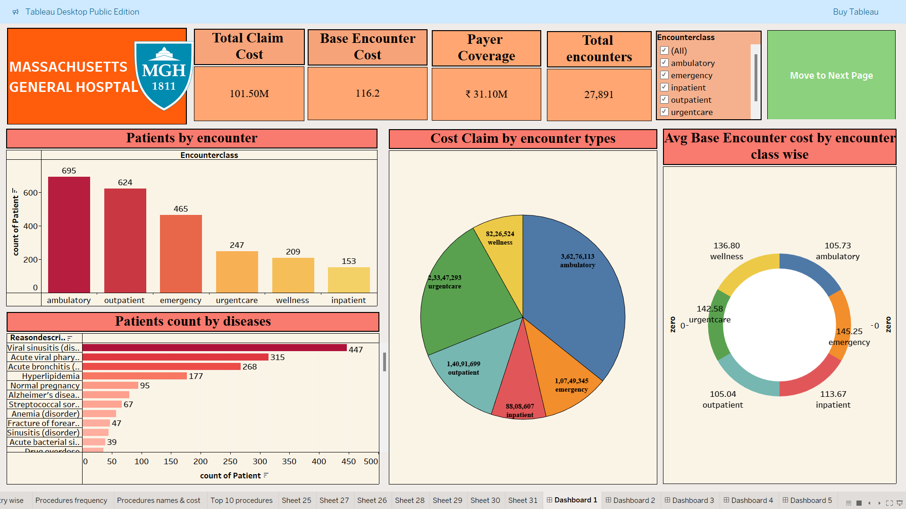
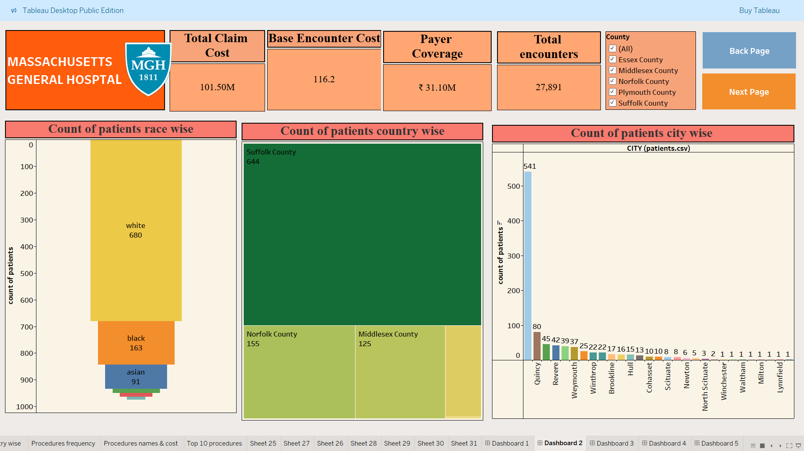
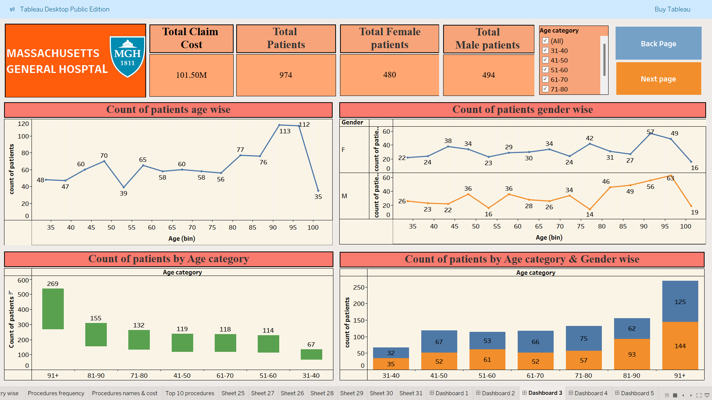
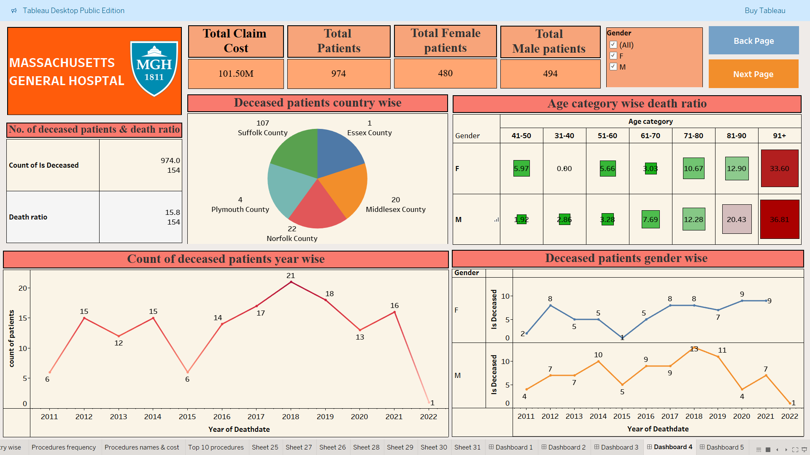
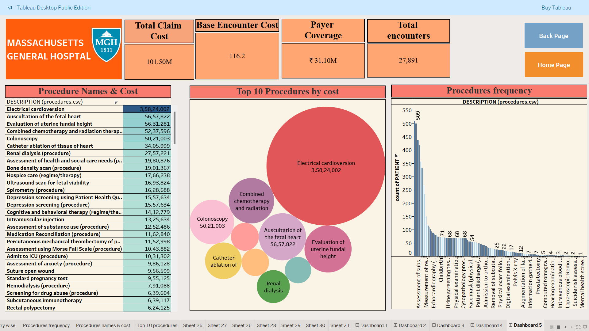

# Hospital Data Analysis Dashboard Tableau

   
  
  
  
  
  

- The Hospital Data Analysis Dashboard is an interactive Tableau project designed to analyze patient demographics, encounter trends, healthcare costs, and mortality insights using healthcare datasets.
- The dashboard transforms raw hospital data into meaningful visual insights that help understand operational performance, patient distribution, and healthcare patterns. This project focuses on data storytelling, KPI tracking, and business-oriented healthcare analytics through interactive visualizations.

🖼️ Dashboard Preview

## 🛠 Technologies

- Tableau
- Microsoft Excel
- Data Visualization
- Healthcare Analytics
- KPI Reporting
- Dashboard Design
- Data Cleaning & Preparation

## ✨ Features

- Interactive healthcare dashboard
- Patient demographic analysis
- Encounter and treatment trend analysis
- Mortality ratio visualization
- Age-group and gender-wise insights
- Country-wise and city-wise patient distribution
- Cost and encounter class analysis
- Dynamic filtering and dashboard interactivity
- Business-oriented KPI reporting

## 🔄 Project Workflow

1. Collected and explored healthcare datasets containing patient, encounter, payer, organization, and procedure information.

2. Performed data cleaning and preprocessing to improve data quality and consistency.

3. Built relationships between multiple tables for effective healthcare analysis.

4. Created calculated fields and KPIs to measure patient trends, healthcare costs, and mortality insights.

5. Designed interactive dashboards in Tableau using charts, filters, and storytelling techniques.

6. Generated business insights from visual analysis to improve healthcare understanding and reporting.

## 📚 What I Learned

- Building interactive dashboards in Tableau
- Working with multi-table healthcare datasets
- Creating meaningful KPIs for business analysis
- Improving data storytelling and visualization techniques
- Understanding healthcare analytics concepts
- Enhancing dashboard design and user experience
- Translating raw data into actionable insights

## 🚀 Overall Growth

- This project helped me improve both my technical and analytical skills by working on a real-world healthcare analytics scenario. 
- I gained practical experience in data visualization, dashboard development, KPI analysis, and business storytelling.
- It also improved my ability to structure complex datasets into meaningful insights that can support decision-making processes.

## 🔮 Future Improvements

- Add advanced Tableau parameters and navigation buttons
- Integrate real-time healthcare datasets
- Include predictive healthcare analytics using Python
- Improve dashboard responsiveness and UI design
- Add more detailed patient risk analysis
- Publish a live Tableau Public version
- Create mobile-friendly dashboard layouts

## ▶️ Running the Project

1. Download the repository files.
2. Open the Tableau Workbook (.twb or .twbx) file using Tableau Desktop.
3. Ensure dataset files are correctly connected if required.
4. Explore the interactive dashboards using filters and navigation options.

> Tableau Desktop or Tableau Public is required to run the dashboard.

## 👨‍💻 Author
Pradnil Birje  
Data Analyst | SQL | Python | Power BI  

- LinkedIn: https://www.linkedin.com/in/pradnilbirje24/
- GitHub: https://github.com/PradnilBirje

## ⭐ Support
If you liked this project, consider giving it a ⭐ on GitHub.
